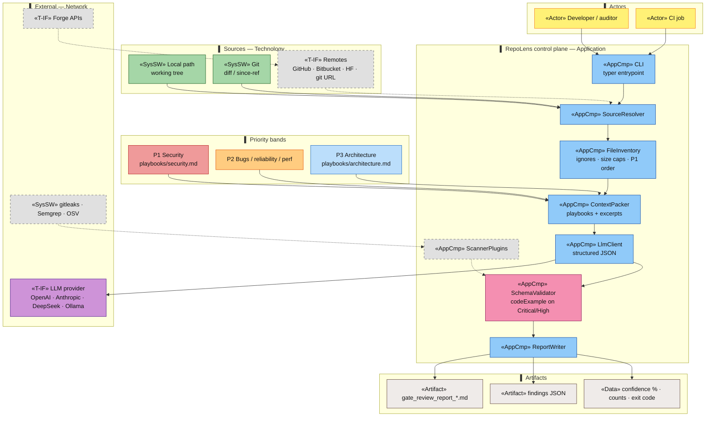
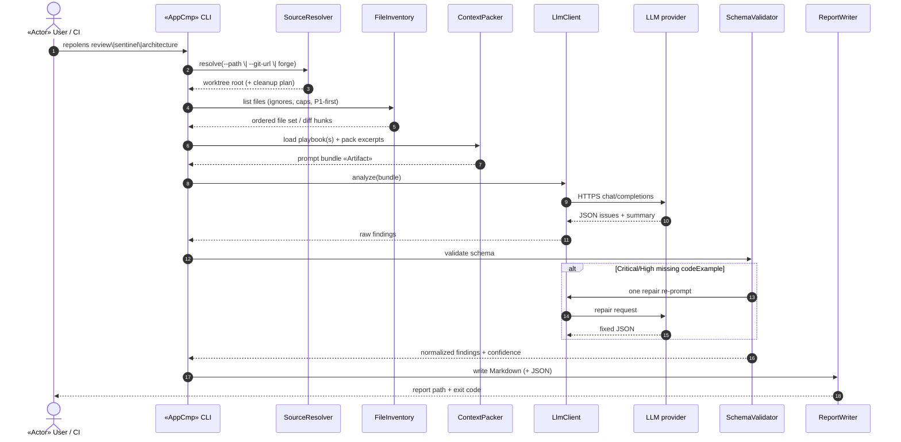
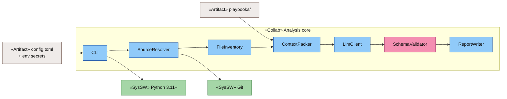
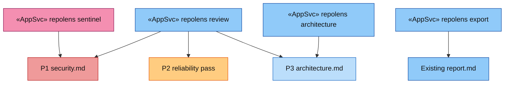
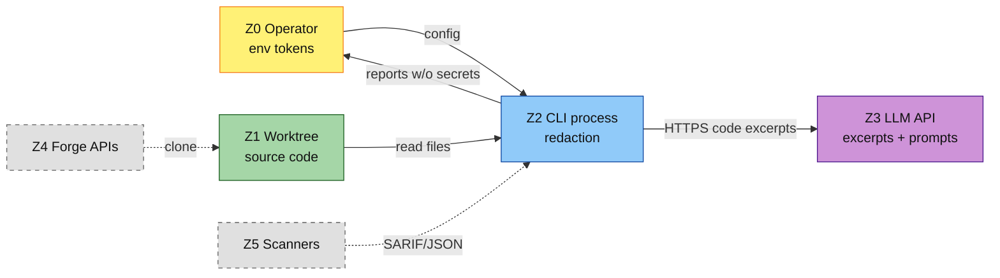

# ADR-01: RepoLens analysis runtime architecture

| Field | Value |
|-------|-------|
| **Status** | **Accepted** (Phase 2 remotes: git-url, GitHub, Bitbucket, Hugging Face) |
| **Date** | 2026-08-04 |
| **Context** | RepoLens must explain—visually and in prose—how a repository is ingested, prioritised (P1→P2→P3), analysed, validated, and reported across local and remote sources without replacing CI scanners. |
| **Decision** | Adopt a **pipeline architecture**: Source → Inventory → Context pack → LLM analyse → Schema validate → Report. Modes (`review`, `sentinel`, `architecture`) select playbooks and priority bands; remotes and scanner plugins are phased add-ons. |
| **CLI language** | Python 3.11+ |
| **Related** | [Diagram legend](_diagram_legend.md) · [CLI & report schema](../design/cli-and-report-schema.md) · [FAQ](../faq.md) · [phases.md](../phases.md) · Playbooks [`security.md`](../../playbooks/security.md) · [`architecture.md`](../../playbooks/architecture.md) |

---

## Document change log

| Date | Summary | Commit |
|------|---------|--------|
| 2026-08-04 | Initial ADR with HLD, sequence, component, and security-zone diagrams | pending |

---

## 0. How to read these diagrams

| View | Question it answers |
|------|---------------------|
| **§1 HLD** | What are the major building blocks and data artifacts? |
| **§2 Sequence** | What happens on one `repolens review` / `sentinel` run? |
| **§3 Components** | Which application components own which step? |
| **§4 Modes** | How do `sentinel` vs `review` vs `architecture` differ? |
| **§5 Security zones** | Where do tokens and code leave the machine? |
| **§6 Phased growth** | What is Phase 1 vs dashed Phase 2–4? |

Colours and prefixes: [_diagram_legend.md](_diagram_legend.md).

---

## 1. High-level design — analysis runtime

### Layer mapping (ArchiMate-inspired)

| Layer | RepoLens mapping |
|-------|------------------|
| Business | Humans / CI invoking the CLI |
| Application | Resolver → inventory → pack → LLM → validate → report |
| Technology | Git, FS, Python, optional scanners |
| Network | LLM HTTPS; forge APIs (Phase 2) |
| Security | Sentinel mode, schema gate, secret redaction, env-only tokens |
| Artifacts | Playbooks in, Markdown/JSON reports out |

---

## 2. Sequence — one review run

**Failure paths:** config/usage → exit `2`; source/auth → `3`; model → `4`; `--fail-on` breached → `1`.

---

## 3. Application components

| Component | Responsibility |
|-----------|----------------|
| **SourceResolver** | Local path or clone remote to temp; checkout `--ref`; schedule cleanup |
| **FileInventory** | Respect ignore globs; size/binary caps; order security-sensitive paths first |
| **ContextPacker** | Attach mode playbooks; chunk/truncate; never embed API keys |
| **LlmClient** | Provider adapters; temperature/token limits; parse JSON |
| **SchemaValidator** | Enforce finding schema; require `impact` + `codeExample` for Critical/High |
| **ReportWriter** | Markdown (required), JSON (optional); stdout summary via Rich |
| **ScannerPlugins** *(Phase 3)* | Merge deterministic findings into the same report section |

---

## 4. Modes → playbooks → priority bands

| Mode | Bands | Playbooks | Typical use |
|------|-------|-----------|-------------|
| `sentinel` | P1 only | `security.md` | Fast security guardrail |
| `review` | P1 → P2 → P3 | security + reliability heuristics + architecture (scoped unless `--full-audit`) | Default due diligence |
| `architecture` | P3 (+ scores) | `architecture.md` | Release / milestone audit |
| `export` | — | — | Markdown → PDF/republish |

---

## 5. Security zones & data movement

| Rule | Detail |
|------|--------|
| Tokens | Env / OS keychain only — never in reports or git |
| Code to LLM | User opts in by running review; document retention with provider |
| Reports | Findings + code examples; strip credential-shaped strings where detected |
| Remotes | Shallow clone to temp; delete after run |

---

## 6. Phased growth (what the grey boxes mean)

| Phase | Adds | Diagram treatment |
|-------|------|-------------------|
| **0** | Playbooks + docs (this ADR) | Baseline |
| **1** | Local `--path`, LLM pipeline, Markdown reports | Solid boxes |
| **2** | `--github` / `--bitbucket` / `--hf` / `--git-url` | Implemented |
| **3** | Optional gitleaks / Semgrep / OSV merge | Dashed until built |
| **4** | GitHub Action, packaging | Out of this runtime diagram |

---

## 7. Consequences

### Positive
- Clear mental model for contributors and adopters  
- Modes map cleanly to playbooks already in-repo  
- Schema gate protects “Critical without a fix example”  
- Same architecture scales from local CLI to CI  

### Trade-offs
- LLM path sends code excerpts off-box (mitigate with local models / Ollama)  
- Context window forces inventory caps and prioritisation (P1-first)  
- Deterministic scanners remain optional complements, not the core  

### Follow-ups
- Implement components in Phase 1 per [cli-and-report-schema.md](../design/cli-and-report-schema.md)  
- Add `docs/adr/exports/` PNG posters if we need icon-heavy slides  
- Future ADR: provider adapter contracts; future ADR: plugin ABI for scanners  

---

## 8. Decision summary

**We will** analyse repositories through a staged pipeline (resolve → inventory → pack → LLM → validate → report), driven by mode-selected playbooks and P1→P2→P3 ordering, with remotes and scanners as explicit later stages—not as a monolithic “scan everything” black box.
