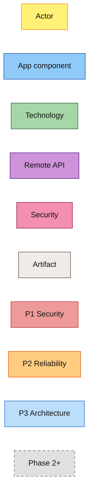

# RepoLens ADR — diagram legend & tooling

> **Use in:** [ADR-01](01_analysis_runtime_architecture.md) and future ADRs  
> **Pattern:** ArchiMate-inspired layer colours, Mermaid-only live fences, shared legend for all RepoLens ADRs.  
> **References:** [The Open Group ArchiMate 3.2](https://pubs.opengroup.org/architecture/archimate3-doc/) · [Mermaid flowchart](https://mermaid.js.org/syntax/flowchart.html)

## Document change log

| Date | Summary | Commit |
|------|---------|--------|
| 2026-08-04 | Initial RepoLens diagram legend and Mermaid colour classes | pending |

---

## 1. Mermaid vs posters (honest split)

| Need | Tool | Why |
|------|------|-----|
| Diffable topology / sequence in-repo | **Mermaid `flowchart` / `sequenceDiagram`** | Renders on GitHub and common Markdown previews |
| Product / brand icon posters | **PNG/SVG exports** (optional later) | Mermaid cannot carry reliable vendor icons in GitHub preview |
| Formal ArchiMate in Visual Paradigm | Optional later | If Mermaid topology is no longer enough for posters |

**Rule:** Do **not** put Mermaid `architecture-beta` or `logos:*` in live ` ```mermaid ` fences (many previewers fail). Use classic `flowchart` / `sequenceDiagram` with the `classDef` colours below.

---

## 2. Colour classes (Mermaid)

| Aspect | Fill | Stroke | `class` name | Use in RepoLens |
|--------|------|--------|--------------|-----------------|
| Business / actor | `#FFF176` | `#F57F17` | `business` | Engineer, CI job, auditor |
| Application | `#90CAF9` | `#0D47A1` | `application` | CLI commands, packer, report writer |
| Technology | `#A5D6A7` | `#1B5E20` | `technology` | Git, filesystem, Python runtime |
| Network / path | `#CE93D8` | `#4A148C` | `network` | GitHub/Bitbucket/HF APIs, LLM HTTPS |
| Security | `#F48FB1` | `#880E4F` | `security` | Sentinel mode, secret redaction, tokens |
| Artifact / data | `#EFEBE9` | `#5D4037` | `artifact` | Playbooks, packed context, reports |
| Priority P1 | `#EF9A9A` | `#B71C1C` | `p1` | Security analysis band |
| Priority P2 | `#FFCC80` | `#E65100` | `p2` | Bugs / reliability / performance |
| Priority P3 | `#BBDEFB` | `#1565C0` | `p3` | Architecture / quality |
| Introduced (phase) | `#A5D6A7` | `#1B5E20` | `phaseNew` | New in active phase |
| Deferred / later phase | `#E0E0E0` | `#616161` | `phaseLater` | Phase 2–4 dashed |



**Text colour:** `#111` / `#1A1A1A` on all shapes. Meaning is carried by **fill + stroke**.

---

## 3. ArchiMate-inspired label prefixes

| Prefix | Meaning | RepoLens examples |
|--------|---------|-------------------|
| `«Actor»` | Business actor | Developer, CI runner |
| `«AppCmp»` | Application component | SourceResolver, ContextPacker, LlmClient, ReportWriter |
| `«AppSvc»` | Application service | `review`, `sentinel`, `architecture`, `export` |
| `«Data»` | Data object | Finding JSON, confidence score |
| `«Artifact»` | Passive artifact | `playbooks/*.md`, `gate_review_report_*.md` |
| `«SysSW»` | System software | Python 3.11+, Git, optional Semgrep |
| `«T-IF»` | Technology interface | HTTPS to LLM / forge APIs |
| `«Path»` | Integration path | Local FS → packer; packer → LLM |

---

## 4. Plateau mapping (RepoLens phases)

| Plateau | RepoLens phase | Meaning |
|---------|----------------|---------|
| **Baseline** | Phase 0 | Docs + playbooks only (no CLI runtime) |
| **CLI alpha** | Phase 1 | Local `--path` reviews via `repolens` (BYOK / Ollama) |
| **Transition** | Phase 1 | Local-path CLI + LLM analysis |
| **Expanded source** | Phase 2 | Remote git hosts |
| **Target durability** | Phase 3–4 | Scanner plugins (Phase 3 done) + CI Action (Phase 4) |

When a diagram shows Phase 2+ nodes, mark them `phaseLater` (grey dashed)—do not imply they ship in Phase 1.

---

## 5. Security zones (CLI)

| Zone | Name | Notes |
|------|------|-------|
| **Z0** | Operator machine | Local path, config, tokens in env |
| **Z1** | Working copy | Checked-out / cloned tree (temp for remotes) |
| **Z2** | Control plane | RepoLens CLI process (no secrets in reports) |
| **Z3** | External LLM | Prompt + code excerpts over HTTPS |
| **Z4** | Forge APIs | GitHub / Bitbucket / HF (Phase 2) |
| **Z5** | Optional scanners | gitleaks / Semgrep / OSV (Phase 3 — shipped) |

**Invariant:** API keys and forge tokens never appear in report artifacts.

---

## 6. How to add a new ADR diagram

1. Link this legend from the ADR header.  
2. Use `classDef` colours from §2.  
3. Prefer one **HLD flowchart** + one **sequence** + optional **component** view.  
4. Add a short **delta / phase table** under the diagram.  
5. Optional later: export PNG/SVG under `docs/adr/exports/`.
