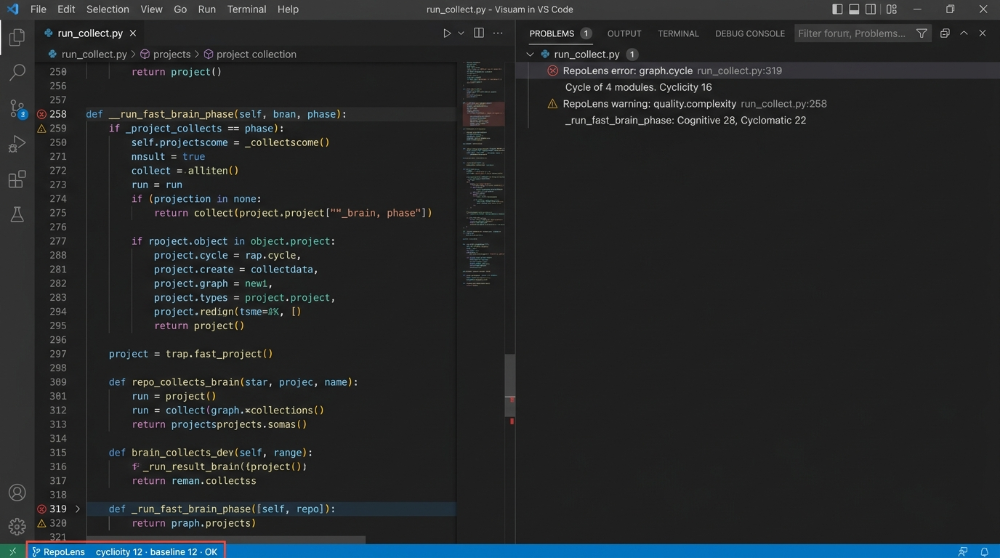
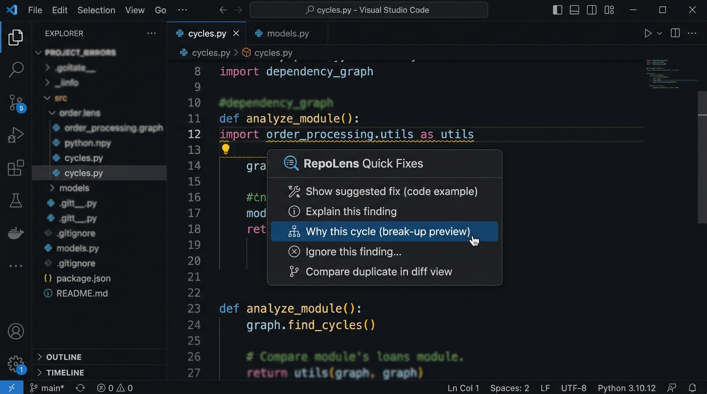
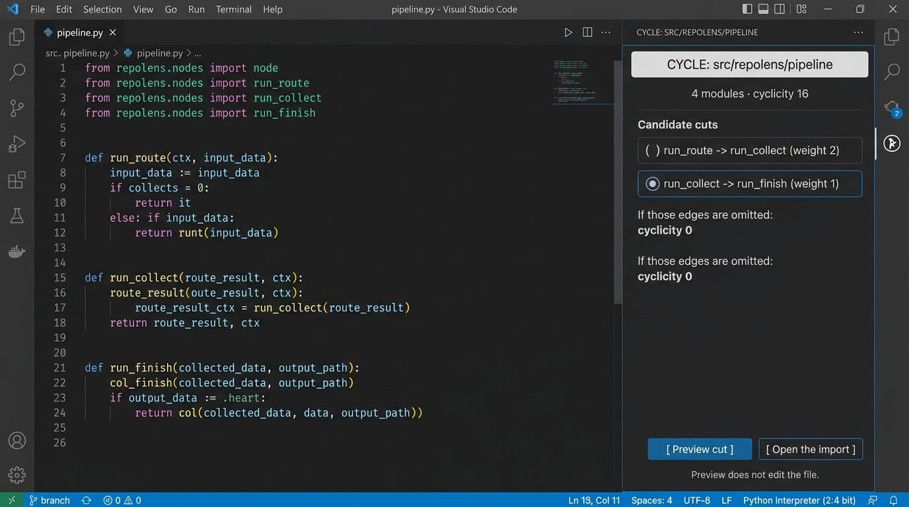
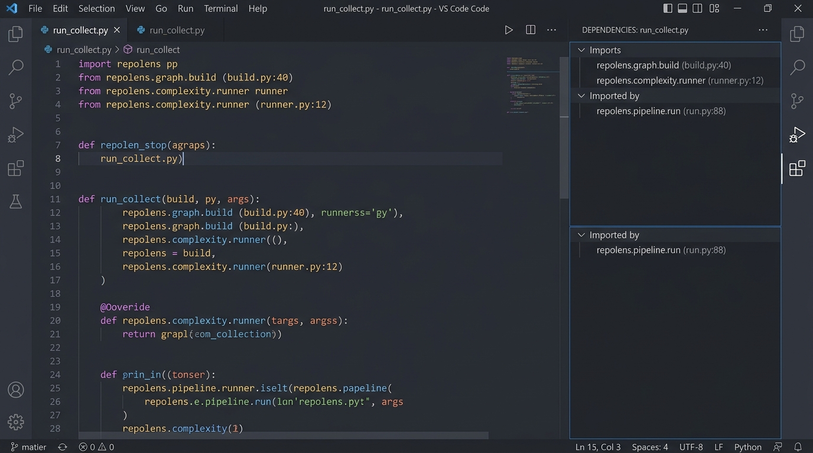
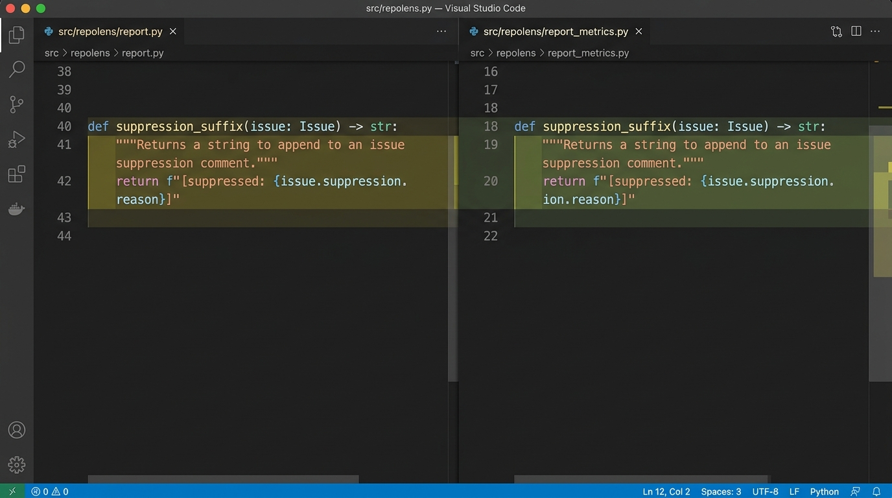

# Which RepoLens command to run

- [Recommended commands](#recommended-commands)
- [Editor UI mockups](#editor-ui-mockups) — images + text sketches in this same document

## Recommended commands

### Plan vs Audit (vocabulary)

| Intent | Command | Notes |
| --- | --- | --- |
| **Plan** (recon) | `repolens plan --path .` | Inventory + Slow Brain pack forecast + chars estimate. **No LLM.** Optional `--role-packs` / `--no-role-packs`. |
| **Plan** (scanners) | `repolens review --path . --scanners-only …` | Scanners without Slow Brain. |
| **Preset** | `repolens review --preset pr\|changed\|release` | `pr` = scanners-only (zero LLM/Ollama); `changed` = `--git-diff auto --deep`; `release` = `--full --full-audit --deep`. Explicit flags override. **`pr` is not a CI gate** — no `--fail-on` / `--ci` unless you add them; use `--ci --fail-on HIGH` for PR fail behavior. |
| **Audit** (one command) | `repolens audit …` | Alias for release due-diligence: scanners + Fast Brain + Slow Brain + `--full-audit` + `--ratchet` + `--verify-findings` + Markdown out. Same as `review --preset release` with ratchet/verify on. |
| **Audit** (flags) | `repolens review --preset release …` | Same kit without the `audit` alias. |
| **Evidence pack** (data room) | `repolens export REPORT.md --evidence-pack` | Timestamped zip: audit Markdown (+ PDF if pandoc), findings JSON/SARIF, SBOM when present, `provenance.json`. |
| **Executive summary** (board) | `repolens export REPORT.md --executive-summary` | 2-page MD/HTML: traffic lights + top Critical/High + attestation. Gate ≠ “% secure”. |
| **Audit diff** (client update) | `repolens diff-audit A.json B.json --format md --out diff.md` | Closed findings · New regressions · Debt drift (cyclicity + complexity). |
| Inventory only | `repolens review --dry-run` | **Protected** semantics — inventory dump; do not overload with forecast/scanners. |

See [compare.md](./compare.md) for “we audit, they edit” vs coding-agent harnesses.

### 1. Full combined result (use this)

One command for **scanners + clean code + cycles + full-tree model write-up** (security, reliability, architecture). This is the dogfood command used on RepoLens today.

```bash
repolens review \
  --path . \
  --out reports/selfdog-deep \
  --full \
  --full-audit \
  --deep \
  --scanners gitleaks,semgrep,osv,trivy,checkov \
  --model qwen2.5-coder:32b \
  --timeout 7200 \
  --verbose
```

| You get | You do not get yet |
| --- | --- |
| Scanner findings (secrets, vulns, risky patterns) | Graph query CLI (`graph deps`, `would-cycle`) |
| Clean-code measurements (long files, duplicates, complexity) | Break-up preview with `--omit-edge` |
| Import-cycle findings and complexity hotspots | Duplicate side-by-side as its own command |
| Model write-up for security, reliability, and architecture (`--full` packs the whole tree; `--full-audit` adds checklist questions; `--deep` runs multi-pass) | Git change-hotspots CLI |
| Markdown report under `--out` | Extra baseline fields beyond cycle-debt |

**Optional flags on the same command** (add any you need):

| Flag | Adds |
| --- | --- |
| `--sarif` | A `.sarif` file next to the Markdown |
| `--import-sarif <path>` | Merge external SARIF (ESLint, CodeQL, Sonar, …) into the same report; repeat the flag for multiple files |
| `--require-sarif-import` | Fail (exit 2) if any `--import-sarif` path is missing or unreadable (default: soft-fail and continue) |
| `--ratchet` | Fail if cycle-debt rose (needs `repolens baseline set --path .` once first) |
| `--format both` | Markdown and JSON reports in one run |
| `--git-diff auto` | PR / change-set Slow Brain: model packs the git diff only (scanners still see the whole tree). **Cannot combine with `--full`** — drop `--full` when you use this; it is usually much faster than packing the whole tree |

**Time:** often an hour or more on local `qwen2.5-coder:32b`. `--timeout 7200` is how long RepoLens waits for the first words from the model, not a promise the whole review finishes in two hours.

If another local review is running, RepoLens queues automatically and yields between passes. Completed passes (P1, P2, P3) are cached on disk, so an interrupted review resumes where it left off — provided the packed files, model, and prompt templates have not changed. After a kill or Ctrl+C, run `repolens journal --path .` for a post-mortem (which pass finished, queue wait vs inference, resume hint). That output is an honesty metric, not a Metis token-cut percentage.

**PR / change-set variant** (faster Slow Brain; no `--full`):

```bash
repolens review \
  --path . \
  --out reports/selfdog-deep \
  --full-audit \
  --deep \
  --deep-passes 1 \
  --git-diff auto \
  --scanners gitleaks,semgrep,osv,trivy,checkov \
  --model qwen2.5-coder:32b \
  --timeout 1800 \
  --verbose
```

### 2. Shorter model pass (Markdown + JSON)

Same review shape, but **one deep pass** and both output formats. Useful when you want the combined story without a long multi-pass wait. Omit `--full` / scanners unless you add them — this line is the lighter model-first variant.

```bash
repolens review \
  --path . \
  --out ./reports/selfdog-deep \
  --full-audit \
  --deep \
  --deep-passes 1 \
  --model qwen2.5-coder:32b \
  --verbose \
  --timeout 3600 \
  --format both
```

To get scanners on this shorter run as well, add the same `--scanners …` line (and `--full` if you want the whole tree packed for the model).

### 3. Fast path (no model)

Scanners and measurements only — minutes, no model write-up.

```bash
repolens review \
  --path . \
  --out reports/selfdog-deep \
  --scanners-only \
  --scanners gitleaks,semgrep,osv,trivy,checkov \
  --sarif \
  --verbose
```

### 4. Ingest external SARIF (ESLint, CodeQL, Sonar, …)

**Now.** Merge enterprise / companion SAST into a RepoLens fast or deep review. Works on command 1, 2, or 3 — `--import-sarif` is not scanners-only-only.

```bash
# Fast path: external SARIF alongside RepoLens scanners
repolens review \
  --path . \
  --out reports/selfdog-deep \
  --scanners-only \
  --scanners gitleaks,semgrep,osv,trivy,checkov \
  --import-sarif /path/to/eslint.sarif \
  --import-sarif /path/to/codeql.sarif \
  --require-sarif-import \
  --verbose
```

Add the same `--import-sarif` / `--require-sarif-import` lines to command 1 when you want those findings in the deep combined report. Details: [ci.md — Import external SARIF](./ci.md#import-external-sarif-companion-gate).

---

## Editor UI mockups

UI mockups for a first Visual Studio Code / Cursor plugin. Findings are fictional so the layout is clear — not a screenshot of a current run. Images live under [`docs/assets/which-command/`](./assets/which-command/) and are shown inline below (open Markdown preview if your editor shows the source only).

### Problems list after save



The yellow row is a warning. The red row fails a gate. Clicking either one opens the file at that line. Status bar cyclicity / queue progress is **target plugin** UI (CLI queue progress is in the terminal today).

<details>
<summary>Text sketch</summary>

```text
┌ RepoLens ─┬─ src/repolens/pipeline/run_collect.py ─────────────┬─ problems ─┐
│           │  318  from repolens.graph import analyse_python   │            │
│  Explorer │  319  gres = analyse_python_graph(...)            │ 2          │
│  Search   │  320                                              │            │
│  Source   │                                                   │ RepoLens   │
│  Run      │                                                   │  error     │
│           │                                                   │  arch.import_cycle  run_collect.py:319
│           │                                                   │  Cycle of 4 modules. Cyclicity 16.
│           │                                                   │  warning   │
│           │                                                   │  quality.complexity   run_collect.py:258
│           │                                                   │  `_run_fast_brain_phase`: Cognitive 28, Cyclomatic 22.
│           │                                                   │            │
├───────────┴───────────────────────────────────────────────────┴────────────┤
│ RepoLens  cyclicity 12 · baseline 12 · OK          Ln 319  Col 4   Python  │
└────────────────────────────────────────────────────────────────────────────┘
```

</details>

### Code actions (lightbulb)



Only “Explain” and “Run full review” exist today. “Show suggested fix”, “Ignore”, “Why this cycle”, and “Compare duplicate” are future plugin/CLI features waiting on the commands in the table below.

<details>
<summary>Text sketch</summary>

```text
┌──────────────────────────────────────────────┐
│ RepoLens                                     │
│    Show suggested fix (code example)         │  (future)
│    Explain this finding                      │  (now: repolens explain)
│    Why this cycle (break-up preview)         │  (future)
│    Ignore this finding…                      │  (CLI now: feedback down; plugin later)
│    Compare duplicate in diff view            │  (future)
└──────────────────────────────────────────────┘
```

</details>

### Command Palette

Same list in Zed (command palette) and IntelliJ (Find Action). Tags match the plugin table below.

```text
> RepoLens:
    RepoLens: Check                              (future: check --format sarif; today: scanners-only --sarif)
    RepoLens: Review Change-Set (--git-diff)     (now: CLI command 1 PR variant / --git-diff auto)
    RepoLens: Run full review                    (now: recommended command 1)
    RepoLens: Open Latest Audit Report           (future plugin; today: open reports/… Markdown)
    RepoLens: Show dependencies of this file     (future)
    RepoLens: Would this import cycle?           (future)
```

### Side panel for a cycle



“Preview cut” re-runs the break-up command with `--omit-edge` and only refreshes the numbers. It does not change the source file.

<details>
<summary>Text sketch</summary>

```text
┌ CYCLE  src/repolens/pipeline ─────────────────────────┐
│ 4 modules · cyclicity 16                              │
│                                                       │
│ Candidate cuts                                        │
│  ( ) run_route → run_collect          weight 2        │
│  (•) run_collect → run_finish         weight 1        │
│                                                       │
│  If those edges are omitted: cyclicity 0              │
│  [ Preview cut ]   [ Open the import ]                │
│                                                       │
│  Preview does not edit the file.                      │
└───────────────────────────────────────────────────────┘
```

</details>

### Dependencies



A list, not a drawing. Each row opens the other file at the import line.

<details>
<summary>Text sketch</summary>

```text
┌ DEPENDENCIES  run_collect.py ─────────────────────────┐
│ Imports                                               │
│   repolens.graph.build            build.py:40         │
│   repolens.complexity.runner      runner.py:12        │
│ Imported by                                           │
│   repolens.pipeline.run           run.py:88           │
└───────────────────────────────────────────────────────┘
```

</details>

### Duplicates



The plugin asks for the two line ranges, then opens the editor’s normal diff. RepoLens does not draw its own compare window.

<details>
<summary>Text sketch</summary>

```text
┌ src/repolens/report.py          │ src/repolens/report_metrics.py ┐
│ 40  def suppression_suffix(     │ 18  def suppression_suffix(     │
│ 41      issue: Issue,           │ 19      issue: Issue,           │
│ 42  ) -> str:                   │ 20  ) -> str:                   │
└─────────────────────────────────┴─────────────────────────────────┘
```

</details>

**IntelliJ.** The same Problems rows sit in the Problems tool window. The cycle list sits in a tool window named RepoLens. The status bar uses the same “cyclicity 12 · baseline 12” text.

**Zed.** Diagnostics appear in the usual diagnostic list. The cycle list and the dependency list are a single buffer or panel. The buttons stay “Preview cut” and “Open the import”.

**What save will not do.** Saving a file will not start `qwen2.5-coder:32b`. That model stays on “RepoLens: Run full review” — recommended command 1 at the top of this page.

### What the plugin can call

A plugin would not embed a second scanner. It would run the CLI and show the results in the editor. **Save** runs the fast check only. The hour-long review stays a command you start yourself.

| You do this | The plugin runs | When it becomes real |
| --- | --- | --- |
| Save a file, or “RepoLens: Check” | `repolens check --path <project> --format sarif` | **Now** in `editors/vscode/` (unpacked). CLI also. |
| Click the status bar | `repolens check --path <project> --diff` | **Now** as CLI and in `editors/vscode/` status bar. Needs `baseline set` once. |
| “Review Change-Set” | Recommended command 1 PR variant (`--git-diff auto`, no `--full`) | **Now** as CLI. Plugin command palette entry is future. |
| “Open Latest Audit Report” | Open newest `gate_review_report_*.md` under `--out` | Future plugin. Today: open the Markdown path from the CLI summary. |
| “Show dependencies” | `repolens graph deps` / `dependents` | **Now** in `editors/vscode/` (Python file open). CLI too. |
| “Would this import cycle?” | `repolens graph would-cycle` | **Now** in `editors/vscode/`. |
| Code action “Why this cycle” | `repolens graph breakup --format json` | **Now** in `editors/vscode/`. |
| Button “Preview cut” | `repolens graph breakup --omit-edge …` | **Now** in `editors/vscode/`. |
| Code action “Compare duplicate” | `repolens duplicates --file … --format json` | **Now** in `editors/vscode/`. |
| Code action “Show suggested fix” | Renders finding's `codeExample` or model diff | Not built. Today: `repolens explain <fingerprint>`. |
| Code action “Ignore” | `repolens ignore add --id …` | **Now** in `editors/vscode/`. |
| Code action “Explain” | `repolens explain <fingerprint>` | **Now** in `editors/vscode/` and CLI. |
| “Run full review” | Copies the CLI command; you paste it in a terminal | **Now.** Save does not start it. |

## What “covered” means

| Topic | Covered when the result contains |
| --- | --- |
| Security | Secrets, known vulnerable libraries, insecure patterns, and (if a model ran) a security write-up |
| Architecture | Import cycles, and either boundary rules or a model write-up of structure |
| Clean code | Very long files, repeated code, and functions that are hard to follow (complexity) |
| SARIF file | A `.sarif` file next to the report, for GitHub or another tool to read |
| Imported SARIF | External findings (ESLint, CodeQL, Sonar, …) merged into the same report via `--import-sarif` |
| Graph queries | A command that lists what a module imports, and what imports it |
| Break-up preview | A list of imports you could remove to untangle a cycle, plus a preview that does not edit your files (`--omit-edge`) |
| Duplicate spans | Two line ranges you can open side by side |
| Ignore | A way to record “leave this finding” so the next run stays quiet |
| Complexity hotspots | The shortest list of the hardest functions |
| Git hotspots | Files that change most often in git history |
| Extra baseline | A saved snapshot of more than cycle-debt, so the build fails when those numbers get worse |

---

## Other commands (by job)

Every example is this repository, run from the RepoLens folder. A command you can run today is marked **now**. A command from the [Sonargraph comparison](./design/sonargraph-architect-comparison.md) that is not implemented yet is marked **not built**. Do not paste a **not built** row into a terminal.

### See the project, change nothing

| Command | What it does | Example |
| --- | --- | --- |
| `repolens review --dry-run` | **Now.** File count only. No scanners, no model, no findings. | `repolens review --path . --out reports/selfdog-deep --dry-run` |

### Security-focused or architecture-focused model runs

| Command | What it does | Example |
| --- | --- | --- |
| `repolens sentinel --deep` | **Now.** Security write-up (not the full reliability/architecture pass). | `repolens sentinel --path . --out reports/selfdog-deep --deep --scanners gitleaks,semgrep,osv,trivy,checkov --model qwen2.5-coder:32b --timeout 7200 --verbose` |
| `repolens architecture --deep` | **Now.** Structure write-up. Not the same as `check architecture` (rules file, no model). | `repolens architecture --path . --out reports/selfdog-deep --deep --model qwen2.5-coder:32b --timeout 7200 --verbose` |
| `repolens review --git-diff auto --deep` | **Now.** Model packs the git change-set (not `--full`); scanners still see the whole tree. Same idea as the PR variant under command 1. | `repolens review --path . --out reports/selfdog-deep --git-diff auto --deep --deep-passes 1 --scanners gitleaks,semgrep,osv,trivy,checkov --model qwen2.5-coder:32b --timeout 1800 --verbose` |
| `repolens review --import-sarif …` | **Now.** Merge external SARIF into the report. See [command 4](#4-ingest-external-sarif-eslint-codeql-sonar-). | `repolens review --path . --out reports/selfdog-deep --scanners-only --import-sarif /path/to/eslint.sarif --require-sarif-import` |
| `repolens review --ci --fail-on HIGH` | **Now.** PR gate: model only when something already looks High/Critical. | `repolens review --path . --out reports/selfdog-deep --ci --deep --fail-on HIGH --quiet` |

### Architecture rules and cycle-debt

| Command | What it does | Example |
| --- | --- | --- |
| `repolens baseline set` / `show` | **Now.** Save or print cycle-debt in `.repolens/baseline.json`. | `repolens baseline set --path .` |
| `repolens check --diff` | **Now.** Fail if cycle-debt grew. No scanners, no model. | `repolens check --diff --require-baseline --path .` |
| `repolens hotspots --since 6.months` | **Now.** Files that change most in git (not function complexity). | `repolens hotspots --path . --since 6.months --format json` |
| `repolens check architecture` | **Now, when a rules file exists.** Boundary violations + candidate cuts as text. This checkout has no rules file until you add one. | `repolens check architecture --path .` |

### After you have a report

| Command | What it does | Example |
| --- | --- | --- |
| `repolens explain <fingerprint>` | **Now.** Plain-language note for one finding. | `repolens explain <fingerprint> --path . --out reports/selfdog-deep --verbose` |
| `repolens feedback down <fingerprint>` | **Now.** Ignore for the next gate counts. | `repolens feedback down <fingerprint> --reason wont_fix --note "accepted for now" --path .` |
| `repolens feedback list` | **Now.** List ignore rows. | `repolens feedback list --path .` |
| `repolens pr-summary <report.json>` | **Now.** Short Critical/High fix list from an existing JSON report. | `repolens pr-summary reports/selfdog-deep/<report>.json` |

---

## Not built yet

| Future command | What it would do | Nearest command that exists |
| --- | --- | --- |
| Native Zed / IntelliJ plugins | In-IDE Problems without copy-paste | `editors/zed/README.md` and `editors/intellij/README.md` (External Tools / tasks) |
| Custom graph canvas | Draw modules as a widget | `repolens graph edges --format json` → editor Markdown preview |

---

